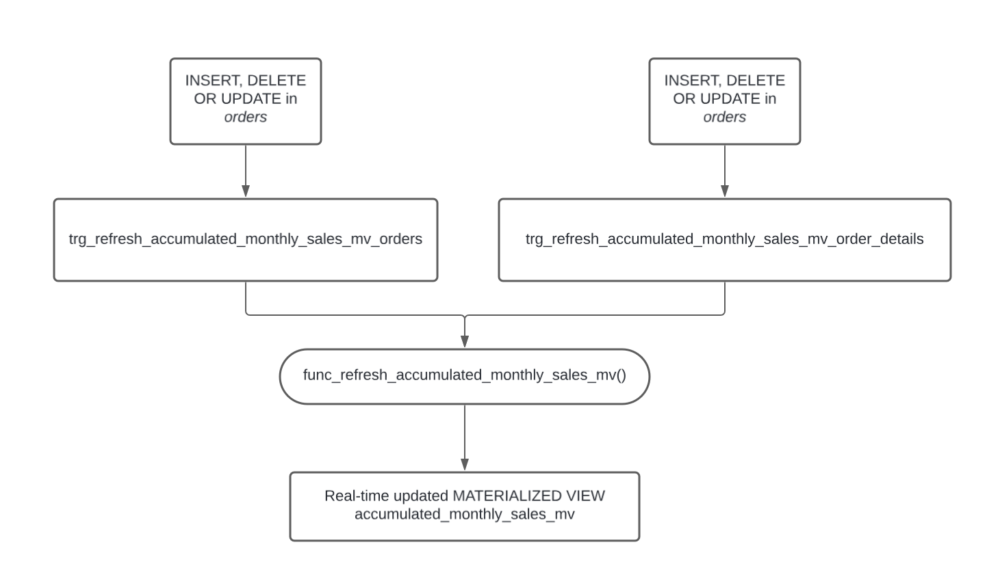
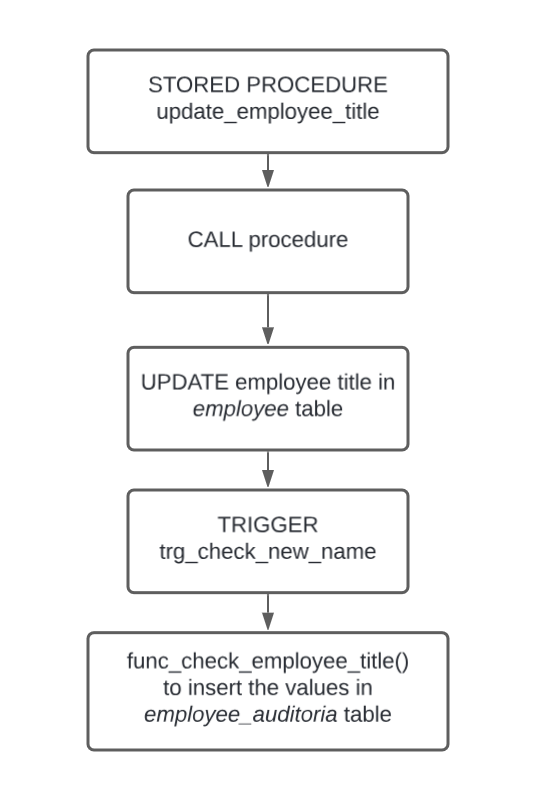

## **Overview:**

This project aims to bring the use of triggers, materialized views, and functions to a Business Intelligence process, where this data could be used to populate a dashboard in Power BI or Streamlit, for example.

## Project 1: Advanced SQL Analysis with Materialized Views, Functions, and Triggers



In this project, I designed and implemented a comprehensive SQL solution to analyze monthly accumulated sales using advanced database techniques. The project includes:

- **Materialized Views**: Created a materialized view to efficiently aggregate and store accumulated monthly sales data.
- **Functions**: Developed a function to refresh the materialized view whenever the underlying data changes.
- **Triggers**: Implemented triggers on `orders` and `order_details` tables to automatically refresh the materialized view upon data modifications (INSERT, DELETE, or UPDATE).

```sql
-- Create materialized view to see monthly accumulated sales
CREATE MATERIALIZED VIEW accumulated_monthly_sales_mv AS 
    SELECT
        EXTRACT(YEAR FROM o.order_date) AS year,
        EXTRACT(MONTH FROM o.order_date) AS month,
        SUM((od.unit_price * od.quantity) * (1-od.discount)) AS accumulated_sales
    FROM 
        order_details AS od
    INNER JOIN 
        orders AS o
    ON
        o.order_id = od.order_id
    GROUP BY
        EXTRACT(YEAR FROM o.order_date),
        EXTRACT(MONTH FROM o.order_date)
    ORDER BY
        EXTRACT(YEAR FROM o.order_date),
        EXTRACT(MONTH FROM o.order_date);

-- Function creation to refresh the materialized view
CREATE OR REPLACE FUNCTION func_refresh_accumulated_monthly_sales_mv() 
RETURNS TRIGGER AS $$
BEGIN
    REFRESH MATERIALIZED VIEW accumulated_monthly_sales_mv; 
    RETURN NEW;
END;
$$ LANGUAGE plpgsql;

-- Trigger creation for the table orders
CREATE TRIGGER trg_refresh_accumulated_monthly_sales_mv_orders
AFTER INSERT OR UPDATE OR DELETE ON orders
FOR EACH STATEMENT
EXECUTE FUNCTION func_refresh_accumulated_monthly_sales_mv();

-- Trigger creation for the table order_details
CREATE TRIGGER trg_refresh_accumulated_monthly_sales_mv_order_details
AFTER INSERT OR UPDATE OR DELETE ON order_details
FOR EACH STATEMENT
EXECUTE FUNCTION func_refresh_accumulated_monthly_sales_mv();
```

This setup ensures real-time and accurate sales analysis with minimal manual intervention, enhancing the performance and reliability of sales reporting, essentially functioning as an ETL process.

## Project 2: Employee Title Change Audit with Stored Procedures and Triggers



This project focuses on maintaining an audit trail for employee title changes using SQL stored procedures and triggers. The implementation includes:

- **Audit Table**: Created an audit table (`employees_auditoria`) to log changes in employee titles (employee_id, old_name, new_name, modification_date).
- **Stored Procedure**: Developed a stored procedure to update employee titles, ensuring all title changes are processed uniformly.
- **Functions and Triggers**: Implemented a function and trigger to automatically insert records into the audit table whenever an employee's title is updated.

```sql
-- audit table to control the employees' title changes
CREATE TABLE employees_auditoria (
	employee_id INT,
	old_name VARCHAR(100),
	new_name VARCHAR(100),
	changed_on TIMESTAMP DEFAULT CURRENT_TIMESTAMP
);

-- stored procedure to change the employees' title
CREATE OR REPLACE PROCEDURE update_employee_title (
	p_employee_id INT,
	p_new_title VARCHAR(100)
)
LANGUAGE plpgsql
AS $$
BEGIN
	UPDATE employees
	SET title = p_new_title
	WHERE employee_id = p_employee_id;
END;
$$;

-- function to insert the changes in the audit table 
CREATE OR REPLACE FUNCTION func_check_employee_title()
RETURNS TRIGGER AS $$
BEGIN
	INSERT INTO employees_auditoria (employee_id, old_name, new_name)
	VALUES (NEW.employee_id, OLD.title, NEW.title);
	RETURN NEW;
END;
$$ LANGUAGE plpgsql;

-- trigger to run the function if a title is changed
CREATE TRIGGER trg_check_new_name
AFTER UPDATE OF title ON employees
FOR EACH ROW
EXECUTE FUNCTION func_check_employee_title();
```

This solution provides a robust mechanism for tracking and auditing changes to employee data, ensuring transparency and accountability in HR operations.

## **Conclusion:**

In this project, I developed advanced SQL solutions to optimize data management and analysis. For sales analysis, I created a materialized view to aggregate monthly sales data, complemented by functions and triggers to ensure real-time updates and efficient reporting. For employee data auditing, I implemented a comprehensive system using stored procedures and triggers to track and log employee title changes, maintaining a detailed audit trail. These solutions significantly enhance data integrity, operational efficiency, and the reliability of business processes.

## **How to run:**

After the analysis, I used Docker to store the database, ensuring a portable, consistent, and isolated environment that can be easily shared and scaled. Docker enhances the development process by allowing seamless replication of the database setup across different systems.

## Configuration

### Manually

* Install and configure PostgreSQL and pgadmin
* Import the provided `nortwhind.sql` file to populate your database

### With Docker and Docker Compose

* You need to install Docker and Docker Compose

* [Start with Docker](https://www.docker.com/get-started)
* [Install Docker Compose](https://docs.docker.com/compose/install/) 

### Steps to Docker configuration:

1. **Initialize Docker Compose:** Run the command below using git bash inside the folder to upload the services:
    
    ```
    docker-compose up
    ```
    
    Wait for the configuration messages, such as:
    
    ```csharp
    Creating network "northwind_psql_db" with driver "bridge"
    Creating volume "northwind_psql_db" with default driver
    Creating volume "northwind_psql_pgadmin" with default driver
    Creating pgadmin ... done
    Creating db      ... done
    ```
       
2. **Conectar o PgAdmin:** Access PgAdmin via the URL: [http://locpostgrealhost:5050](http://localhost:5050), with the password `postgres`. 

Set up a new server in PgAdmin:

    * **General tab**:
        * Name: db
    * **Connection tab**:
        * Host name: db
        * Username: postgres
        * Password: natan 
    Then select the “northwind” database".

4. **Insert the SQL code:** Insert the SQL code: "accumulated_sales.sql" and "audit_employee.sql". To test the accumulated sales project you can insert new data with the northwind_insert_sales.sql code.

3. **Stopping Docker Compose:** Stop the started server by the command `docker-compose up` using Ctrl-C and remove the containers with:
    
    ```
    docker-compose down
    ```
    
4. **Files and Persistence:** Your changes to the Postgres databases will be persisted on the Docker volume `postgresql_data` and can be recovered by restarting Docker Compose with `docker-compose up`. To delete the data from the database, run:
    
    ```
    docker-compose down -v
    ```


